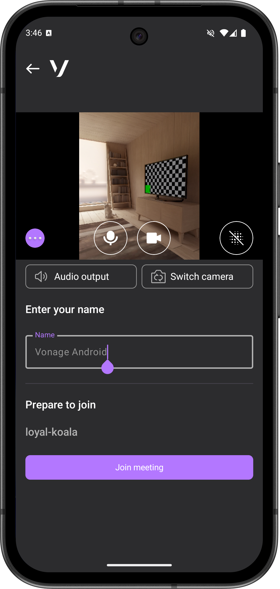
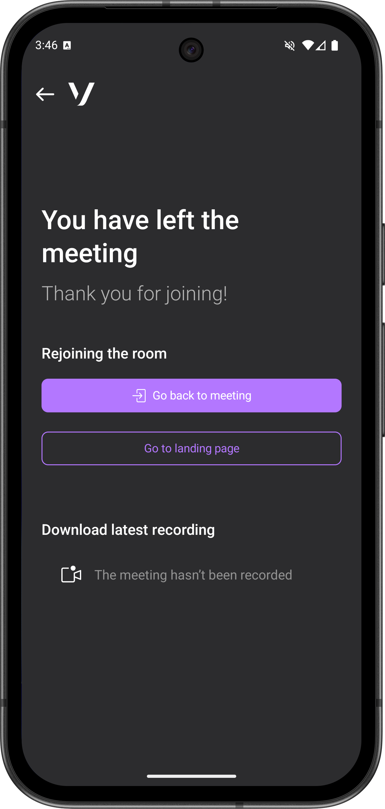
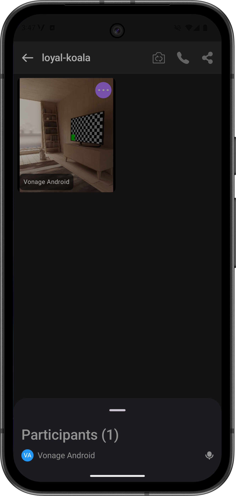

# Vonage Video API Reference App for Android


## Welcome to Vonage

If you're new to Vonage, you can [sign up for a Vonage API account](https://dashboard.nexmo.com/sign-up?utm_source=DEV_REL&utm_medium=github&utm_campaign=vonage-video-android-app) and get some free credit to get you started.

## What is it?

The Vonage Video API Reference App for Android is an open-source video conferencing reference application for the [Vonage Video API](https://developer.vonage.com/en/video/client-sdks/web/overview) using the Android SDK.

The Reference App demonstrates the best practices for integrating the [Vonage Video API](https://developer.vonage.com/en/video/client-sdks/web/overview) with your application for various use cases, from one-to-one and multi-participant video calling to foreground services integration and more.

## Why use it?

The Vonage Video API Reference App for Android provides developers an easy-to-setup way to get started with using our APIs with the Android SDK.

The application is open-source, so you can not only get started quickly, but easily extend it with features needed for your use case. Any features already implemented in the Reference App use best practices for scalability and security.

As a commercial open-source project, you can also count on a solid information security architecture. While no packaged solution can guarantee absolute security, the transparency that comes with open-source software, combined with the proactive and responsive open-source community and vendors, provides significant advantages in addressing information security challenges compared to closed-source alternatives.

This application provides features for common conferencing use cases, such as:

- <details>
    <summary>A landing page for users to create and join meeting rooms.</summary>
    
  </details>

- <details>
    <summary>A waiting room for users to preview their audio and video device settings and set their name before entering a meeting room.</summary>
    
  </details>

- <details>
    <summary>A post-call page to navigate users to the landing page, re-enter the left room, and display archive(s), if any.</summary>
    
  </details>

- A video conferencing "room" supporting up to 25 participants and the following features:

- <details>
    <summary>
      Configurable features: adapt the app to your specific use cases and roles.
      Configuration is handled through JSON files in the <em>config</em> folder (<em>app-config.json</em>, <em>theme.json</em>). The custom Gradle plugin reads these configuration files and generates the necessary build configuration at compile time.
    </summary>
  </details>

- <details>
    <summary>Call participant list with audio on/off indicator.</summary>
    
  </details>

- Screen sharing integration.

- Active speaker detection.

- Layout manager with options to display active speaker, or all participants in a grid view.

- The dynamic display adjusts to show new joiners, hide video tiles to conserve bandwidth, and show the "next" participant when someone previously speaking leaves.

- Foreground Service: Keeps the video call running in the background with proper Android notification handling.

## Project Architecture

This reference app requires the user to deploy a backend and then use the backend API URL as the base URL in the app configuration. You can find backend code and deploying instructions in the [vonage-video-react-app](https://github.com/Vonage/vonage-video-react-app) repository.

The backend communicates with the Vonage video platform using the Vonage Server SDK and is responsible for generating the session IDs and tokens used to connect to the video rooms by the Vonage Client SDK.

## Module Overview

The Vonage Android reference app is built with a modular architecture. The app is organized into the following modules:

- **app**: Main application module and composition root
- **kotlin**: Vonage Video SDK integration and core business logic
  - `VonageVideoClient`: Main SDK client
  - `Call`: Call lifecycle management
  - `model`: Domain models (CallFacade, Participant, PublisherState, etc.)
  - `signal`: Signal plugins (chat, reactions)
  - `internal`: Internal implementations (audio device, active speaker tracking, screen sharing)
  - `ext`: Extension functions for reactive programming
- **compose**: Reusable Compose UI components and Material Design 3 theme
- **shared**: Shared utilities and domain models
- **vonage-feature-chat**: Meeting room chat (optional feature module)
- **build-tools**: Custom Gradle plugins for configuration generation

## Platforms supported

The current minimum deployment target for the reference app is Android 7.0 (API 24+). The app is optimized for phones and tablets and supports the following architectures: ARM64-v8a, ARMv7, x86, and x86_64.

## Requirements

- **Android Studio**: Ladybug (2024.2.1) or newer
- **JDK**: Version 17 or higher
- **Gradle**: 8.11.0+ (via wrapper)

## Running Locally

First follow the steps to create the Vonage account, application and backend set up and deployment at the [vonage-video-react-app](https://github.com/Vonage/vonage-video-react-app?tab=readme-ov-file#running-locally) URL.

Clone the repository:

```bash
git clone https://github.com/Vonage/vonage-video-android-app.git
cd vonage-video-android-app
```

Configure the application by editing the JSON files in the `config` folder:

- `app-config.json`: Feature flags and application settings
- `theme.json`: UI theme configuration

Open the project in Android Studio and let Gradle sync complete.

Modify the base URL constant in your configuration to point to your deployed backend.

Build and run the app:

```bash
./gradlew installDebug
```

Or use Android Studio's run button (▶️) to build and deploy to a connected device or emulator.

## Feature configuration

You can fork the repository and start modifying it for your needs. Or you can modify the configuration files in the `config` folder:

- `app-config.json`: Configure feature flags like chat, captions, screen sharing, background blur, etc.
- The custom Gradle plugin (`JsonConfigPlugin`) reads these configuration files at build time
- Features can be enabled/disabled without code changes
- Some features use product flavors (e.g., chat module with enabled/disabled variants)

See [docs/CONFIG-SYSTEM.md](docs/CONFIG-SYSTEM.md) for detailed configuration documentation.

## Theme customization

You can customize the app colors by editing the `config/theme.json` file with your desired color scheme values. The `ThemeGeneratorPlugin` Gradle plugin will generate the necessary theme resources in the `compose` module at build time.

## Testing

This project uses JUnit for unit tests, MockK for mocking, Turbine for Flow testing, and Espresso for instrumentation tests.

Run tests from the command line:

```bash
# Run all unit tests
./gradlew test

# Run instrumentation tests (requires connected device/emulator)
./gradlew connectedAndroidTest

# Run tests for specific module
./gradlew :kotlin:test

# Generate code coverage report
./gradlew koverHtmlReport
```

Or run tests in Android Studio by right-clicking on test files or packages and selecting "Run Tests".

## Code style

We use Detekt for static analysis and Spotless for code formatting. Check and fix code style by running:

```bash
# Check code style
./gradlew detekt

# Run all quality checks
./gradlew check
```

## Code of Conduct

Please read our [Code of Conduct](docs/CODE_OF_CONDUCT.md).

## Getting Involved

If you wish to contribute to this project, read how in [Contributing](docs/CONTRIBUTING.md).

## Known Issues

We track known issues in [Known Issues](docs/KNOWN_ISSUES.md). Please refer to it for details.

## Report Issues

If you have any issues, feel free to open an issue or reach out to support via [support@api.vonage.com](mailto:support@api.vonage.com).

## Getting Help

We love to hear from you so if you have questions, comments or find a bug in the project, let us know! You can either:

* Open an issue on this repository
* Tweet at us! We're [@VonageDev on Twitter](https://twitter.com/VonageDev)
* Or [join the Vonage Developer Community Slack](https://developer.vonage.com/community/slack)

## Further Reading

* Check out the Developer Documentation at <https://developer.vonage.com\>
