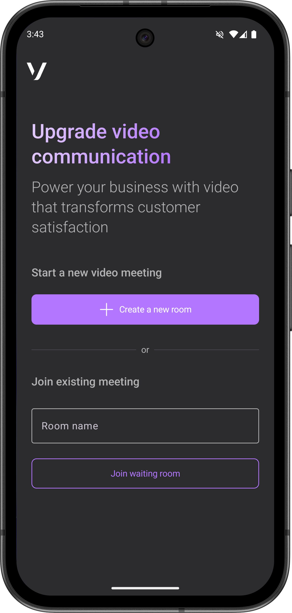
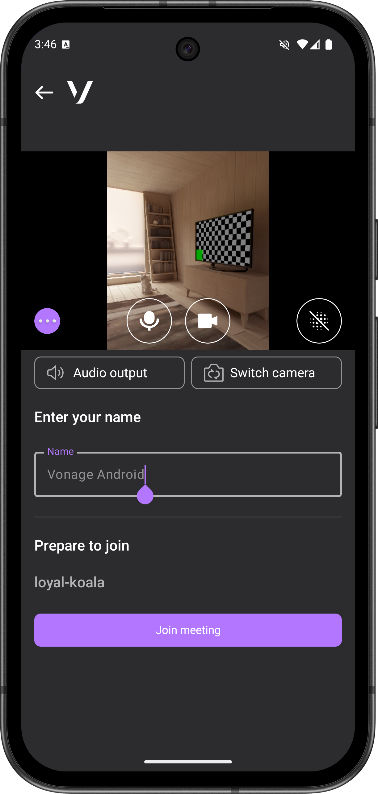
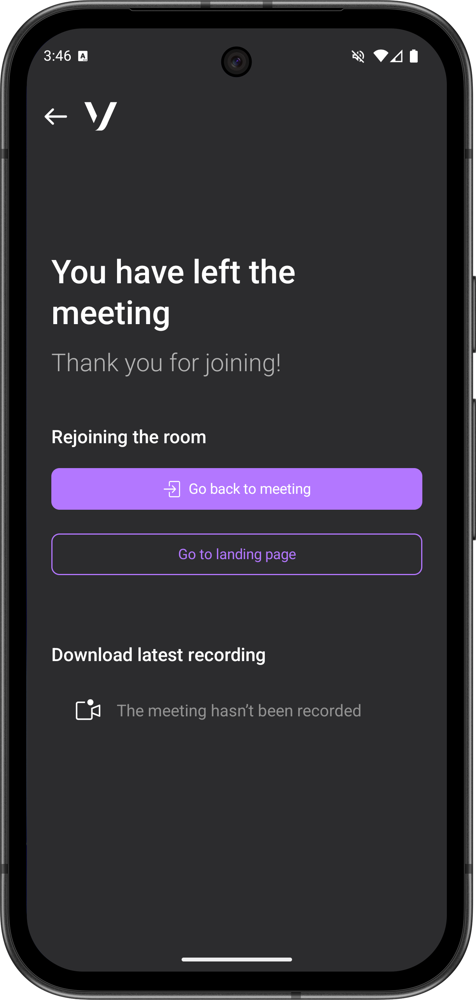
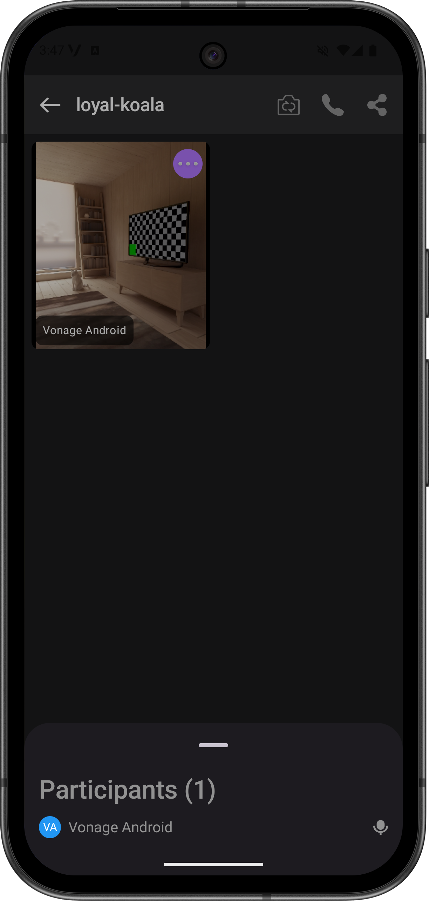

# Vonage Video API Reference App for Android

## Welcome to Vonage

If you're new to Vonage, you can [sign up for a Vonage API account](https://dashboard.nexmo.com/sign-up?utm_source=DEV_REL&utm_medium=github&utm_campaign=vonage-video-android-app) and get some free credit to get you started.

## What is it?

The Vonage Video API Reference App for Android is an open-source video conferencing reference application for the [Vonage Video API](https://developer.vonage.com/en/video/client-sdks/web/overview) using the Android SDK.

The Reference App demonstrates the best practices for integrating the [Vonage Video API](https://developer.vonage.com/en/video/client-sdks/web/overview) with your application for various use cases, from one-to-one and multi-participant video calling to foreground services integration and more.

## Cross-Platform Support

Looking to build on other platforms? The Vonage Video API Reference App is also available for:

- **Web (React)**: [vonage-video-react-app](https://github.com/Vonage/vonage-video-react-app)
- **iOS**: [vonage-video-ios-app](https://github.com/Vonage/vonage-video-ios-app)

These reference apps share the same backend infrastructure and demonstrate consistent best practices across all platforms, making it easy to build unified video experiences for your users.

## Why use it?

The Vonage Video API Reference App for Android provides developers an easy-to-setup way to get started with using our APIs with the Android SDK.

The application is open-source, so you can not only get started quickly, but easily extend it with features needed for your use case. Any features already implemented in the Reference App use best practices for scalability and security.

As a commercial open-source project, you can also count on a solid information security architecture. While no packaged solution can guarantee absolute security, the transparency that comes with open-source software, combined with the proactive and responsive open-source community and vendors, provides significant advantages in addressing information security challenges compared to closed-source alternatives.

This application provides features for common conferencing use cases, such as:

- 

    
A landing page for users to create and join meeting rooms.

    
  

- 

    
A waiting room for users to preview their audio and video device settings and set their name before entering a meeting room.

    
  

- 

    
A post-call page to navigate users to the landing page, re-enter the left room, and display archive(s), if any.

    
  

- A video conferencing "room" supporting up to 25 participants and the following features:

- 

    

      Configurable features: adapt the app to your specific use cases and roles.
      Configuration is handled through JSON files in the <em>config</em> folder (<em>app-config.json</em>, <em>theme.json</em>). The custom Gradle plugin reads these configuration files and generates the necessary build configuration at compile time.
    

  

- 

    
Call participant list with audio on/off indicator.

    
  

- Screen sharing integration.

- Active speaker detection.

- Layout manager with options to display active speaker, or all participants in a grid view.

- The dynamic display adjusts to show new joiners, hide video tiles to conserve bandwidth, and show the "next" participant when someone previously speaking leaves.

- Foreground Service: Keeps the video call running in the background with proper Android notification handling.

## Platforms & Requirements

- **Minimum Android version**: 7.0 (API 24+), optimized for phones and tablets
- **Architectures**: ARM64-v8a, ARMv7, x86, x86_64
- **Vonage Video SDK**: Tested with 2.32 and 2.33 — use the latest available version
- **Android Studio**: Ladybug (2024.2.1) or newer
- **JDK**: 17 or higher
- **Gradle**: 8.13.0+ (via wrapper)

## Documentation

| Document | Description |
|---|---|
| [Getting Started](docs/GETTING_STARTED.md) | Clone, configure the backend URL, build, and run the app |
| [Configuration](docs/CONFIGURATION.md) | Feature flags, theme customization, and base URL setup |
| [Config System](docs/CONFIG-SYSTEM.md) | Deep-dive into the JSON-driven config plugin system |
| [Authentication](docs/AUTHENTICATION.md) | Optional Okta sign-in, token injection, and identity provider setup |
| [Localization](docs/LOCALIZATION.md) | Multi-language support and how to add a new language |
| [Testing](docs/TESTING.md) | Unit tests, instrumented tests, snapshot tests, and Maestro E2E |
| [Code Style](docs/CODE_STYLE.md) | Detekt, Spotless, and code conventions |
| [Contributing](docs/CONTRIBUTING.md) | How to contribute to this project |
| [Known Issues](docs/KNOWN_ISSUES.md) | Tracked known issues |
| [Code of Conduct](docs/CODE_OF_CONDUCT.md) | Community code of conduct |

## Contributing

If you wish to contribute to this project, read how in [Contributing](docs/CONTRIBUTING.md). Please also read our [Code of Conduct](docs/CODE_OF_CONDUCT.md).

We track known issues in [Known Issues](docs/KNOWN_ISSUES.md).

## Getting Help

We love to hear from you! If you have questions, comments, or find a bug:

* Open an issue on this repository
* Reach out via [support@api.vonage.com](mailto:support@api.vonage.com)
* Tweet at us! We're [@VonageDev on Twitter](https://twitter.com/VonageDev)
* [Join the Vonage Developer Community Slack](https://developer.vonage.com/community/slack)

## Further Reading

* Check out the Developer Documentation at <https://developer.vonage.com/>

