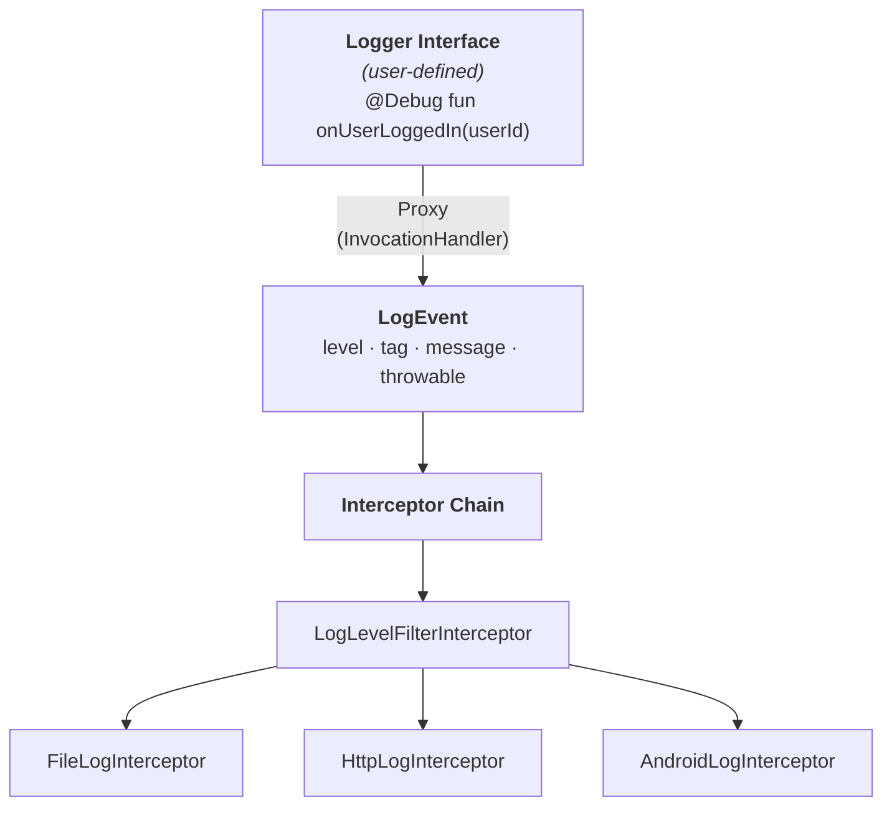

# Vonage Android Logger

A lightweight logging library for Android. Define logger interfaces with annotated methods and let `VonageLogger` create implementations via `InvocationHandler`. All log events flow through a configurable interceptor chain.

## Architecture



## Quick Start

### 1. Define a Logger Interface

```kotlin
@Tag("MyApp")
interface AppLogger {
    @Debug
    fun onUserLoggedIn(userId: String)

    @Info
    fun onSessionStarted()

    @Error
    fun onCrash(message: String, error: Throwable)
}
```

### 2. Build the Logger

```kotlin
val vonageLogger = VonageLogger.Builder()
    .addInterceptor(LogLevelFilterInterceptor(LogLevel.DEBUG))
    .addInterceptor(AndroidLogInterceptor())
    .build()
```

### 3. Create & Use

```kotlin
val logger: AppLogger = vonageLogger.create()

logger.onUserLoggedIn("user-42")   // D/MyApp: on user logged in | user-42
logger.onSessionStarted()          // I/MyApp: on session started
logger.onCrash("Oops", exception)  // E/MyApp: on crash | Oops  (with throwable)
```

## Annotations

| Annotation         | Target    | Description                                           |
|---------------------|-----------|-------------------------------------------------------|
| `@Tag("value")`    | Interface | Sets the log tag for all methods. Defaults to the interface name. |
| `@Verbose`         | Method    | Produces a `VERBOSE` level log event.                 |
| `@Debug`           | Method    | Produces a `DEBUG` level log event.                   |
| `@Info`            | Method    | Produces an `INFO` level log event.                   |
| `@Warn`            | Method    | Produces a `WARN` level log event.                    |
| `@Error`           | Method    | Produces an `ERROR` level log event.                  |
| `@Log(LogLevel.*)` | Method    | Produces a log event with the specified level.        |

## Interceptors

Interceptors follow the **chain-of-responsibility** pattern (like OkHttp). Each interceptor can observe, transform, short-circuit, or handle log events.

### Built-in Interceptors

| Interceptor                | Description                                                                                                   |
|----------------------------|---------------------------------------------------------------------------------------------------------------|
| `AndroidLogInterceptor`    | Writes log events to Android Logcat using `android.util.Log`.                                                 |
| `FileLogInterceptor`       | Appends timestamped log lines to a file on disk. Thread-safe with automatic rotation when max size is reached. |
| `HttpLogInterceptor`       | POSTs log events as JSON to an HTTPS endpoint on a background thread.                                         |
| `LogLevelFilterInterceptor`| Drops events below a configurable minimum `LogLevel`.                                                         |

### `FileLogInterceptor`

Persists logs to a file with automatic size-based rotation.

```kotlin
val logFile = File(context.filesDir, "app.log")

VonageLogger.Builder()
    .addInterceptor(FileLogInterceptor(logFile))
    .build()
```

Each line is written as:

```
2026-02-10 14:30:05.123 [ERROR] MyTag: something failed
java.lang.RuntimeException: boom
```

| Parameter      | Default                      | Description                                       |
|----------------|------------------------------|---------------------------------------------------|
| `file`         | —                            | The file to append log lines to.                  |
| `maxFileSize`  | `5 MB`                       | File is cleared when this size is exceeded.        |
| `dateFormat`   | `yyyy-MM-dd HH:mm:ss.SSS`   | Timestamp format for each log line.               |

### `HttpLogInterceptor`

Sends log events as JSON to a remote endpoint over HTTPS.

```kotlin
VonageLogger.Builder()
    .addInterceptor(HttpLogInterceptor("https://logs.example.com/v1/ingest"))
    .build()
```

JSON payload:

```json
{
  "level": "ERROR",
  "tag": "MyApp",
  "message": "on crash | Oops",
  "throwable": "java.lang.RuntimeException: boom"
}
```

| Parameter        | Default  | Description                               |
|------------------|----------|-------------------------------------------|
| `url`            | —        | The HTTPS endpoint to POST to.            |
| `executor`       | Single-threaded | `ExecutorService` for background dispatch. |
| `connectTimeout` | `5000`   | Connection timeout in milliseconds.        |
| `readTimeout`    | `5000`   | Read timeout in milliseconds.              |

### Custom Interceptor

```kotlin
class TimestampInterceptor : LogInterceptor {
    override fun intercept(chain: LogInterceptor.Chain): LogEvent {
        val event = chain.event()
        val timestamped = event.copy(
            message = "[${System.currentTimeMillis()}] ${event.message}"
        )
        return chain.proceed(timestamped)
    }
}
```

### Short-Circuiting

An interceptor can stop the chain by not calling `chain.proceed()`:

```kotlin
class SilenceInterceptor : LogInterceptor {
    override fun intercept(chain: LogInterceptor.Chain): LogEvent {
        // Swallow the event — nothing downstream is called.
        return chain.event()
    }
}
```

## Message Formatting

Method names are automatically converted from `camelCase` to readable sentences, and arguments are appended:

| Method Call                         | Formatted Message                     |
|--------------------------------------|---------------------------------------|
| `onUserLoggedIn("user-42")`         | `on user logged in \| user-42`        |
| `heartbeat()`                       | `heartbeat`                           |
| `onMultiArg("a", 1, true)`         | `on multi arg \| a, 1, true`         |

`Throwable` parameters are automatically extracted into `LogEvent.throwable` and excluded from the message.

## API Reference

### `VonageLogger`

| Method                              | Description                                               |
|---------------------------------------|-----------------------------------------------------------|
| `create(Class<T>): T`               | Creates a proxy of the given logger interface.            |
| `create<T>(): T` (reified)          | Kotlin convenience — infers type from reified generic.    |

### `VonageLogger.Builder`

| Method                              | Description                                               |
|---------------------------------------|-----------------------------------------------------------|
| `addInterceptor(LogInterceptor)`     | Adds an interceptor to the chain (in order).              |
| `build(): VonageLogger`             | Constructs the `VonageLogger` instance.                   |

### `LogInterceptor`

| Method                              | Description                                               |
|---------------------------------------|-----------------------------------------------------------|
| `intercept(chain: Chain): LogEvent`  | Process a log event; call `chain.proceed()` to continue.  |

### `LogInterceptor.Chain`

| Method                              | Description                                               |
|---------------------------------------|-----------------------------------------------------------|
| `event(): LogEvent`                  | Returns the current log event.                            |
| `proceed(event: LogEvent): LogEvent` | Forwards the event to the next interceptor.               |
