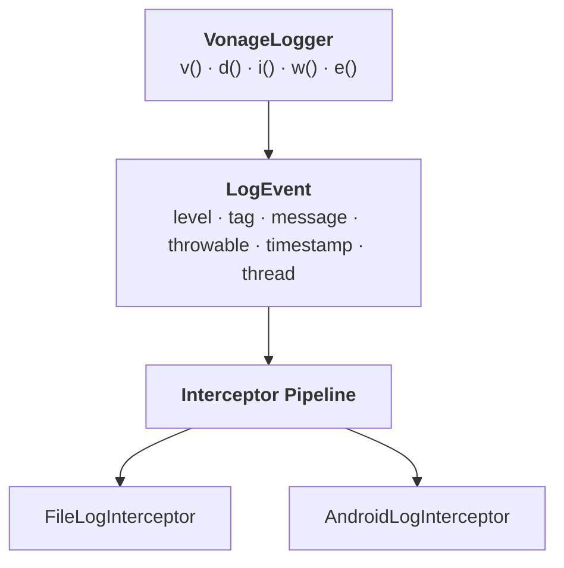

# Vonage Android Logger

A lightweight logging library for Android. Call log methods directly on `VonageLogger` and let all events flow through a configurable interceptor pipeline.

## Architecture



## Quick Start

### 1. Build the Logger

```kotlin
val logger = VonageLogger.Builder()
    .addInterceptor(AndroidLogInterceptor())
    .build()
```

Or use the provided default instance:

```kotlin
// Uses AndroidLogInterceptor out of the box
val logger = vonageLogger
logger.d("MyApp", "User logged in")
```

### 2. Use It

```kotlin
logger.d("MyApp", "User logged in")           // D/MyApp: User logged in
logger.i("MyApp", "Session started")          // I/MyApp: Session started
logger.e("MyApp", "Something failed", error)  // E/MyApp: Something failed  (with throwable)
```

## Log Methods

| Method | Level |
|--------|-------|
| `v(tag, message, throwable?)` | `VERBOSE` |
| `d(tag, message, throwable?)` | `DEBUG` |
| `i(tag, message, throwable?)` | `INFO` |
| `w(tag, message, throwable?)` | `WARN` |
| `e(tag, message, throwable?)` | `ERROR` |
| `log(level, tag, message, throwable?)` | Explicit level |

## LogEvent

Each log call produces a `LogEvent` data class:

| Field       | Type         | Description                                      |
|-------------|--------------|--------------------------------------------------|
| `level`     | `LogLevel`   | `VERBOSE`, `DEBUG`, `INFO`, `WARN`, or `ERROR`.  |
| `tag`       | `String`     | Caller-supplied tag.                              |
| `message`   | `String`     | Log message.                                     |
| `throwable` | `Throwable?` | Optional exception (default `null`).              |
| `timestamp` | `Long`       | Epoch millis, captured automatically.             |
| `thread`    | `String`     | Thread name, captured automatically.              |

## Interceptors

Interceptors form a sequential pipeline. Each interceptor receives a `LogEvent` and returns either a (possibly modified) event to continue, or `null` to drop the event.

```kotlin
fun interface LogInterceptor {
    fun intercept(event: LogEvent): LogEvent?
}
```

### Built-in Interceptors

| Interceptor                | Description                                                                                                   |
|----------------------------|---------------------------------------------------------------------------------------------------------------|
| `AndroidLogInterceptor`    | Writes log events to Android Logcat using `android.util.Log`.                                                 |
| `FileLogInterceptor`       | Appends timestamped log lines to a file on disk. Thread-safe with automatic rotation when max size is reached. |

### `FileLogInterceptor`

Persists logs to a file with automatic size-based rotation.

```kotlin
val logFile = File(context.filesDir, "app.log")

val logger = VonageLogger.Builder()
    .addInterceptor(FileLogInterceptor(logFile))
    .build()
```

Each line is written as:

```
2026-02-10 14:30:05.123 [main] [ERROR] MyTag: something failed
java.lang.RuntimeException: boom
```

| Parameter      | Default                      | Description                                       |
|----------------|------------------------------|---------------------------------------------------|
| `file`         | —                            | The file to append log lines to.                  |
| `maxFileSize`  | `5 MB`                       | File is cleared when this size is exceeded.        |
| `dateFormat`   | `yyyy-MM-dd HH:mm:ss.SSS`   | Timestamp format for each log line.               |

### Custom Interceptor

```kotlin
class TimestampInterceptor : LogInterceptor {
    override fun intercept(event: LogEvent): LogEvent {
        return event.copy(
            message = "[${event.timestamp}] ${event.message}"
        )
    }
}
```

### Dropping Events

An interceptor can drop an event by returning `null`:

```kotlin
class MinLevelInterceptor(private val minLevel: LogLevel) : LogInterceptor {
    override fun intercept(event: LogEvent): LogEvent? {
        return if (event.level >= minLevel) event else null
    }
}
```

## API Reference

### `VonageLogger`

| Method                              | Description                                               |
|---------------------------------------|-----------------------------------------------------------|
| `v(tag, message, throwable?)`        | Log at `VERBOSE` level.                                   |
| `d(tag, message, throwable?)`        | Log at `DEBUG` level.                                     |
| `i(tag, message, throwable?)`        | Log at `INFO` level.                                      |
| `w(tag, message, throwable?)`        | Log at `WARN` level.                                      |
| `e(tag, message, throwable?)`        | Log at `ERROR` level.                                     |
| `log(level, tag, message, throwable?)`| Log at the specified level.                               |

### `VonageLogger.Builder`

| Method                              | Description                                               |
|---------------------------------------|-----------------------------------------------------------|
| `addInterceptor(LogInterceptor)`     | Adds an interceptor to the pipeline (in order).           |
| `build(): VonageLogger`             | Constructs the `VonageLogger` instance.                   |

### `DefaultVonageLogger`

A pre-configured singleton with `AndroidLogInterceptor`. Access via:

```kotlin
val logger = vonageLogger
```

### `LogInterceptor`

| Method                              | Description                                               |
|---------------------------------------|-----------------------------------------------------------|
| `intercept(event: LogEvent): LogEvent?` | Process a log event; return it to continue, `null` to drop. |

### `LogLevel`

```
VERBOSE < DEBUG < INFO < WARN < ERROR
```
